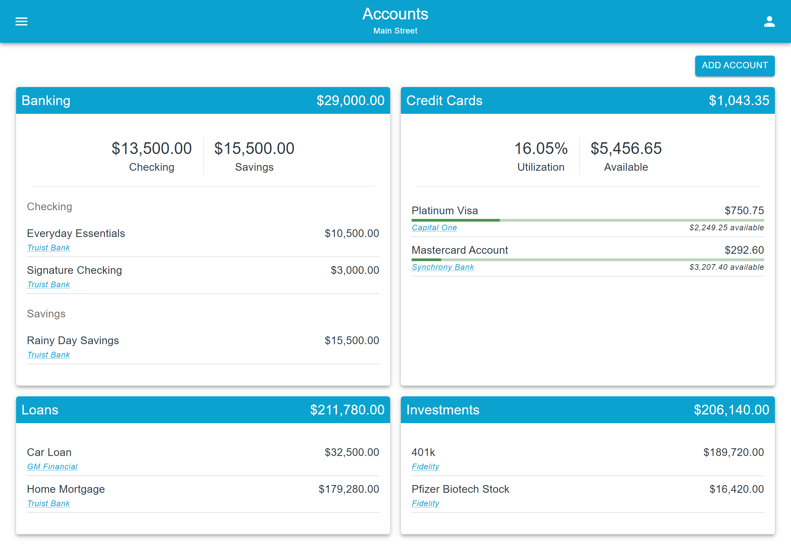
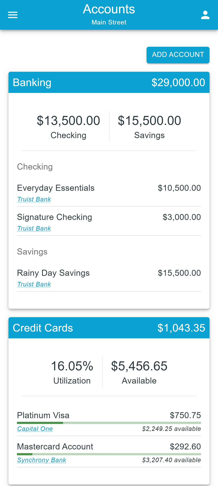

# Financial Accounts

## Overview

**Path:** /financial/accounts/

The *Financial Accounts* view provides users the ability to view a list of all their financial accounts. These accounts are grouped and summarized by type:

- Banking (Checking and Savings Accounts)
- Credit Cards
- Loans
- Investments

Each account listed displays:

- Account Name
- Current Balance
- Financial Institution (hyperlink)
- Available Balance (Credit Cards only)
- Utilization % (Credit Cards only)

From this listing, users are also able to create new accounts and navigate to the [Account Overview](./AccountOverview.md) screen to view, create, edit, and delete transactions associated with the selected account.

## Example Screens

### iPad

### Mobile Phone

    

## Technical Details

### Actions

- Clear Account
- Clear Transactions
- Get Accounts
- Set Title

### Components

#### Material-UI

- [Button](https://mui.com/components/buttons/)
- [Container](https://mui.com/components/container/)
- [Grid](https://mui.com/components/grid/)
- [Typography](https://mui.com/components/typography/)

#### Custom

- [Account List](./Components/AccountList.md)
- [Banking List](./Components/BankingList.md)
- [Credit List](./Components/CreditList.md)
- [Loading Message](../General/LoadingMessage.md)
- [Summary Card](../General/SummaryCard.md)

### Source Code Specs

- Lines of Code: 145